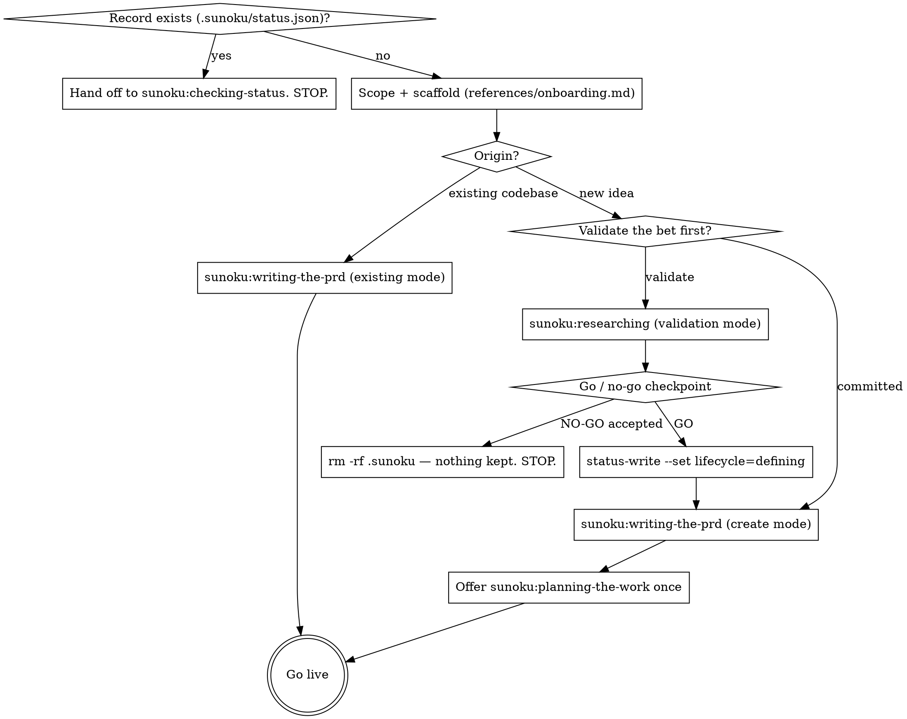

# Starting a Product

## Overview

User-only orchestrator: route by origin, chain the working skills, hold exactly three
checkpoints — go/no-go, PRD approval, and the task-breakdown offer. Sunoku never writes
application code and never touches anything outside `.sunoku/`.

**Announce at start:** "I'm using the sunoku:starting-a-product skill to set up the record."

## Checklist

Create a todo for each item:

1. Route on the record (existing record → hand off, stop)
2. Scope and scaffold (references/onboarding.md)
3. Run the origin's flow to an approved PRD
4. Offer the task breakdown (fresh-idea path only)
5. Go live

## Process Flow

Notes on the boxes:

- **Route on the record**: if `.sunoku/status.json` exists, say so in one line (product,
  lifecycle) and hand off to sunoku:checking-status. No re-init, no writes.
- **Scope + scaffold**: read
  `${CLAUDE_PLUGIN_ROOT}/skills/starting-a-product/references/onboarding.md` and follow it —
  it collects product name, one-liner, origin, and for new ideas the validate-or-committed
  choice, then scaffolds.
- **Go/no-go checkpoint**: present sunoku:researching's recommendation, recommended option
  first. NO-GO accepted → delete `.sunoku/` entirely (`rm -rf .sunoku`), tell the user nothing
  is kept and why that is fine (re-pitching means fresh validation). GO →
  `node "${CLAUDE_PLUGIN_ROOT}/scripts/status-write.mjs" --set lifecycle=defining`.
- **Breakdown offer**: fresh-idea path only, offered ONCE after PRD approval: "want a task
  breakdown (milestones, epics, parallel-ready tasks)?" Existing-codebase records get
  planning on demand later, not an init offer.
- **Go live**:
  `node "${CLAUDE_PLUGIN_ROOT}/scripts/status-write.mjs" --set lifecycle=live --set tracking=true`,
  then close by naming the surface: sunoku:checking-status for state and next action,
  sunoku:writing-the-prd for PRD changes, sunoku:planning-the-work for breakdown,
  sunoku:researching for deep dives; record questions are answered automatically
  (sunoku:querying-the-record), reshapes are detected with consent
  (sunoku:tracking-changes).

## Discipline

- **Three checkpoints only** (go/no-go, PRD approval, breakdown offer). Anything else a run
  wants to ask becomes a `decisions.jsonl` row with a recommended default — the fired skill
  logs it and continues.
- `status.json` is script-written only: `scaffold.mjs` creates it, `status-write.mjs` mutates
  it.

## Integration

- **REQUIRED SUB-SKILL:** sunoku:researching (validation mode) on the validate path
- **REQUIRED SUB-SKILL:** sunoku:writing-the-prd (create or existing mode)
- Offered once after PRD approval: sunoku:planning-the-work
