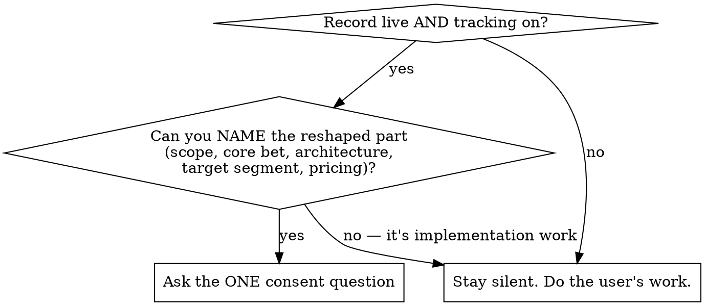

# Tracking Changes

## Overview

Detector + consent gate + handoff. This skill writes nothing, ever. Silent is the default —
a noisy tracker is a broken tracker.

## Fire or Stay Silent

## The Consent Question

Ask ONE question before any tracking, recommended option first:

> "This looks like it reshapes the PRD (<part>): <one-line what>. Update the PRD?
> (a) update — recommended (b) skip tracking"

- (a) → invoke sunoku:writing-the-prd (reshape mode) with the change and affected part; its
  Change Log row IS the tracking.
- (b) → proceed with the work; the record stays untouched.

Never ask twice for the same change in a session.

## Red Flags

| Thought | Reality |
|---------|---------|
| "It's clearly a scope change, I'll just log it" | NEVER auto-track. Consent first, every time. |
| "Bugfix touches the architecture section topic" | Bugfixes, styling, refactors, perf, config, copy, in-scope features: silent. |
| "I'll jot this in a journal for later" | This skill writes nothing, ever. There is no journal. |
| "I can't name which part changes, but it feels big" | Can't name the part = implementation work. Stay silent. |

## Integration

- **REQUIRED SUB-SKILL on consent:** sunoku:writing-the-prd (reshape mode).
