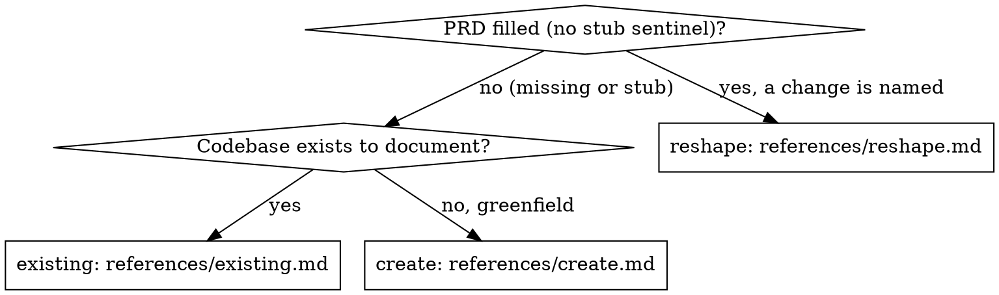

# Writing the PRD

## Overview

Own `.sunoku/PRD.md` — the human artifact and, via its Change Log table, the record's only
history. One checkpoint per run: approval of the draft (create/existing) or of the patch
(reshape).

**Announce at start:** "I'm using the sunoku:writing-the-prd skill to draft/patch the PRD."

<HARD-GATE>
No draft or patch lands without user approval at the checkpoint. Present, then wait.
</HARD-GATE>

## Mode Selection

Requires a scaffolded record (`.sunoku/status.json` present) — if absent, route the user to
sunoku:starting-a-product and stop.

Read the mode's reference under `${CLAUDE_PLUGIN_ROOT}/skills/writing-the-prd/references/`
and follow it exactly.

## Rules

- Template: `${CLAUDE_PLUGIN_ROOT}/skills/writing-the-prd/templates/PRD.md`. Keep its section
  set; the Change Log table format (`| date | change | why | trigger |`) is machine-read —
  never alter its columns.
- Every feature row traces to evidence (a research file / decision id) or names its
  assumption.
- Assumptions taken while drafting become decision rows with a recommended default
  (`decisions.mjs --add`, `"by":"prd"`); the run continues without waiting.
- A user answer that changes the PRD is a reshape; after patching, resolve the row
  (`decisions.mjs --resolve <id> --answer "..."`).
- After any approved draft or patch, restamp the record so staleness counting resets:
  `node "${CLAUDE_PLUGIN_ROOT}/scripts/status-write.mjs" --set one_liner="..."` when the
  one-liner changed, `--touch` otherwise.
- Never write application code; never touch files outside `.sunoku/`.

## Integration

- Invoked by: sunoku:starting-a-product (create/existing), sunoku:tracking-changes (reshape),
  or the user directly.
- Dispatches subagents via `references/product-owner-prompt.md` and (existing mode)
  `references/codebase-analyst-prompt.md`.
- After approval on the fresh-idea init path, control returns to sunoku:starting-a-product
  for the breakdown offer.
